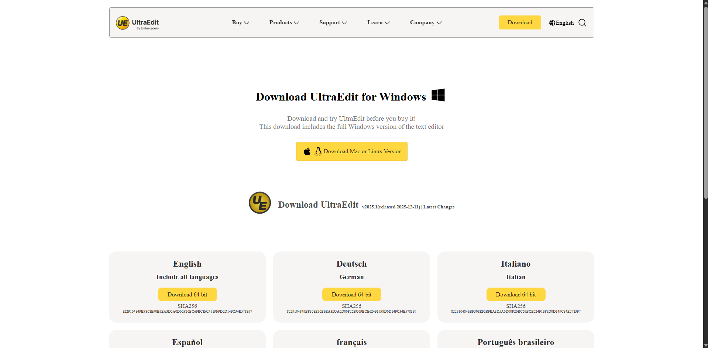
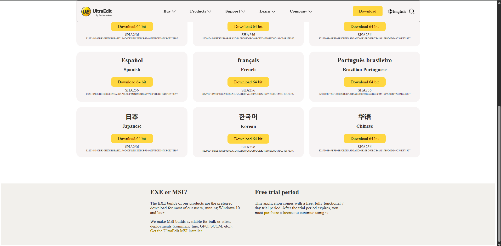

# UltraEdit Website

A responsive clone of the **UltraEdit official website**, built using **HTML and CSS** as a learning project.

## 🚀 Project Overview
This project replicates the UI and layout of the UltraEdit website to practice:
- Semantic HTML structure
- CSS Flexbox & Grid
- Sticky navigation bar
- Hover effects & basic animations
- Real-world website layout techniques

## 🛠️ Tech Stack
- **HTML5**
- **CSS3**

## ✨ Features
- Sticky navigation bar
- Responsive layout
- Grid-based content sections
- Hover interactions
- Clean and modern UI inspired by UltraEdit

## 📸 Preview




## 📂 How to Run Locally
1. Clone the repository
   ```bash
   git clone https://github.com/your-username/your-repo-name.git

---

## ⚠️ Disclaimer

This project is created strictly for **educational and learning purposes only**.

I do **not own** the UltraEdit name, logo, brand assets, or any related trademarks.  
This project is **not affiliated with, endorsed by, or associated with UltraEdit or IDM Computer Solutions** in any way.

All trademarks, logos, and brand names belong to their respective owners.